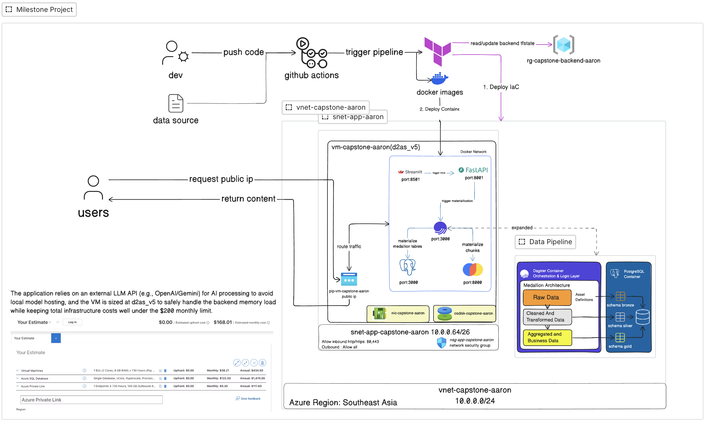

# EC Bootcamp GenAI Capstone

A RAG chatbot over two different data sources: bank product PDFs (ChromaDB) and customer records (Postgres). A Dagster medallion pipeline (bronze → silver → gold) cleans and joins the customer CSVs and chunks/embeds the PDFs; a FastAPI backend retrieves from whichever source(s) you pick and answers via Azure OpenAI; a Streamlit frontend is the chat UI.

## Reflection

Building this project made me realize how complex even a “simple” RAG chatbot can be. There are so many moving parts: data ingestion, pipeline orchestration, vector search, and keeping the backend, frontend, and AI service aligned. It made me appreciate how hard it is to make software, especially in the industry with real clients.

## Architecture Diagram



## Architecture

| Component | What it is | Docs |
| --- | --- | --- |
| `pipelines/` | Dagster project: medallion pipeline for customer CSVs + PDF chunking/embedding into ChromaDB | [`pipelines/README.md`](pipelines/README.md) |
| `backend/` | FastAPI service: `/chat` and `/upload`, retrieval + Azure OpenAI generation | [`backend/README.md`](backend/README.md) |
| `frontend/` | Streamlit chat UI | [`frontend/README.md`](frontend/README.md) |
| `infra/` | Terraform (Azure VM + networking) and the GitHub Actions CI/CD pipeline that deploys the stack there | [`infra/README.md`](infra/README.md) |

Locally, all of it runs as 5 containers via Docker Compose: `postgres`, `chromadb`, `dagster-webserver`, `backend`, `frontend`. In production it's the same `docker-compose.yml`, deployed to a single Azure VM by `.github/workflows/ci.yml`.

## Quickstart (Docker Compose)

```bash
cp .env.sample .env    # fill in your Azure OpenAI credentials and DB config
docker compose up -d
```

Then materialize the Dagster assets once (equivalent to clicking "Materialize" in the Dagster UI), so the knowledge base and customer tables actually have data:

```bash
docker compose exec dagster-webserver dagster asset materialize --select '*' -m pipelines.definitions
```

Open:
- Frontend (chat UI): http://localhost:8501
- Backend API docs: http://localhost:8001/docs
- Dagster UI: http://localhost:3000
- ChromaDB heartbeat: http://localhost:8000/api/v1/heartbeat

## Repo layout

```
backend/     FastAPI service (chat + upload endpoints, retrieval logic)
frontend/    Streamlit chat UI
pipelines/   Dagster project: medallion pipeline + document ingestion
infra/       Terraform for the Azure VM, plus its README covers CI/CD secrets and deployment
docker-compose.yml   The 5-container local/production stack
```

## Working on a single component

Each of `backend/`, `frontend/`, and `pipelines/` can also run standalone for development (its own `uv sync`, no Docker required for that piece) — see that component's README for specifics and required environment variables.

## Deploying

See [`infra/README.md`](infra/README.md) for provisioning the Azure VM with Terraform and setting up the GitHub Actions secrets that drive automatic deployment on every push to `main`.

## Testing

[`L1_TESTS.md`](L1_TESTS.md) is a verification checklist of L1 questions (facts stated explicitly in the source PDFs/CSVs, with a known-correct expected answer) for manually sanity-checking the chatbot after a deploy or a pipeline change.